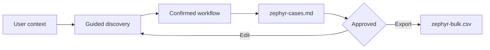

# Zephyr Test Case Creator

[](https://skills.sh/jmora-co/zephyr)
[](https://www.skills.sh/docs/cli)
[](https://support.smartbear.com/zephyr/docs/en/test-cases/import-test-cases.html)

An Agent Skill that turns functional workflows into clear, complete Zephyr test cases ready to import into Jira.

It does not invent the workflow for the user. It explores the available context, proposes useful options, and guides the definition of every step from the initial state to an observable outcome.

## Installation

You need Node.js with `npx` available. There is no need to clone the repository or install a global package.

### Recommended: choose the agent and scope

```bash
npx skills add jmora-co/zephyr
```

The installer detects compatible agents and lets you choose where to install the Skill.

### Global installation for all compatible agents

```bash
npx skills add jmora-co/zephyr -g -a '*' -y
```

The global installation makes the Skill available across all your projects. To install it only in the current project, use the recommended command and select project scope.

## Usage

Invoke the Skill from your agent:

```text
Use $zephyr-test-case-creator to create a Zephyr case for the plan creation workflow.
```

You can also provide context from the beginning:

```text
Use $zephyr-test-case-creator to map the happy path for ADM-3557.
Explore this repository to identify the navigation flow and ask me whenever
you find functional decisions that cannot be confirmed from the code.
```

The conversation follows the user's language. Test case content is written in English by default to keep Zephyr consistent.

## How It Works



1. Read the available manual workflow, code, PRD, Jira issue, screenshots, Figma designs, or documentation.
2. Identify the actor, objective, entry point, preconditions, and final outcome.
3. Propose concrete alternatives only when a decision is missing.
4. Build one test case with precise actions and observable expected results.
5. Generate `zephyr-cases.md` for human review.
6. After explicit approval, export the Zephyr-compatible `zephyr-bulk.csv`.

## Two Paths, Less Friction

| Path | When It Is Used | Behavior |
| --- | --- | --- |
| Fast | The user has already provided an almost complete workflow | Normalize the case and ask only about ambiguities |
| Guided | Material parts of the journey are missing | Discover the workflow step by step with contextual options |

For UI workflows, the Skill proposes starting from login. If authentication is outside the test scope, it is documented as a `Precondition`. Alternate workflows, errors, and permission scenarios are suggested as separate executions to keep each case focused.

## Generated Files

The Skill creates only these files in the directory where it is executed:

| File | Purpose |
| --- | --- |
| `zephyr-cases.md` | Human-readable source for review and approval |
| `zephyr-bulk.csv` | Final bulk-import file for Zephyr |

The approved Markdown is the single source of truth for the CSV. No intermediate JSON files are created, and existing files are never overwritten without explicit approval.

## Zephyr Format

The exporter generates the 20 columns used by the Zephyr contract, including:

- Test case metadata in the first row.
- Additional steps as continuation rows.
- Separate `Step`, `Test Data`, and `Expected Result` columns.
- UTF-8 encoding and comma delimiter.
- Validation for metadata, coverage, and expected results.

To import the CSV, select Excel CSV, UTF-8, comma delimiter, row 1 as the starting row, and map the step-by-step columns. See the [official Zephyr import documentation](https://support.smartbear.com/zephyr/docs/en/test-cases/import-test-cases.html).

## Structure

```text
.
├── SKILL.md
├── agents/
│   └── openai.yaml
├── assets/
│   └── zephyr-cases-template.md
├── references/
│   ├── guided-discovery.md
│   └── zephyr-format.md
└── scripts/
    └── export_zephyr_csv.py
```

The exporter uses only the Python standard library and requires no additional dependencies.

## Principles

- One test case per execution.
- User-provided information takes precedence over inference.
- Questions include options, consequences, and a recommendation when supported by evidence.
- Expected results are specific and observable.
- Variants remain separate from the main workflow.
- Human approval is required before export.

---

Built to turn functional conversations into Zephyr cases that teams can review, maintain, and import with confidence.
